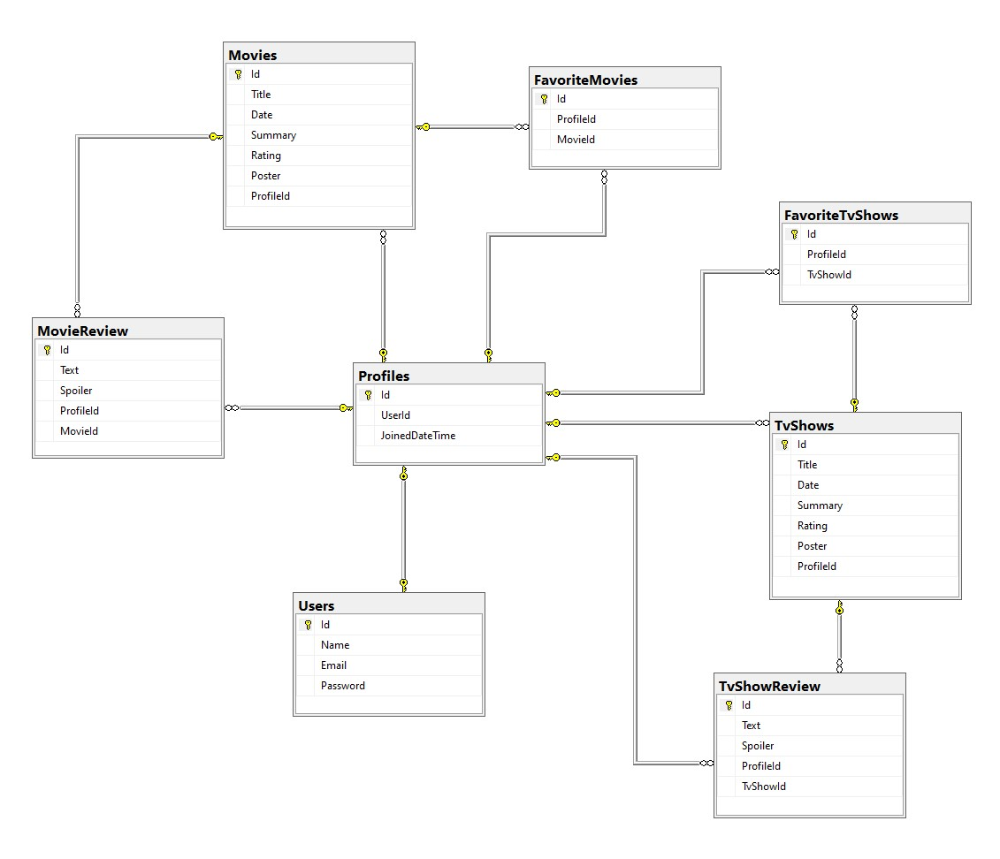

<div dir="rtl" align="right" >


----

# Movies Library | مكتبة الأفلام
  
### المقدمــة | Introduction 
 في هذا المشروع أقدم جميع ما تعلمته خلال الشهر الشهر الثاني من المعسكر في مشروع واحد.
  المشروع عبارة عن قاعدة بيانات للأفلام والمسلسلات, والمستخدم له القدرة على تفضيل الافلام والمسلسلات واضافتها إلى قاعدة البيانات. تم استخدام ASP.NET في Back-End و React.js في Front-End.
 
### Demo  
### [Vdeio Demo](https://drive.google.com/file/d/1OCpNAfHEgh1v7Og9hsXO4MwEep72z89y/view?usp=sharing "video demo of the project").
  
### Wireframe 

 

### ER Diagram



### Set up  
### Prerequisites
- NET 5 
- ASP.NET MVC
- Microsoft SQL Server 
- Nodejs
### Set up  
 #### Clone the Repo
 ```git clone https://github.com/ibra0022/Project04_Auth_CRUD_ASP.NET.git```
 #### Database
 ```dotnet ef database update```

 #### React App
 ```npm i```
### Front-End  
 - HTML
 - CSS
 - JS
 - React
 - Bootstrap 
### Back-End 
 - ASP.NET MVC Web API
 - MSSQL Server
 - EF Core

### Author
 ابراهيم العبيسي Ibrahim Alobaysi

### License & Resource
 .....

</div>
